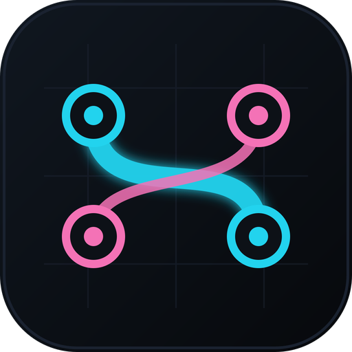
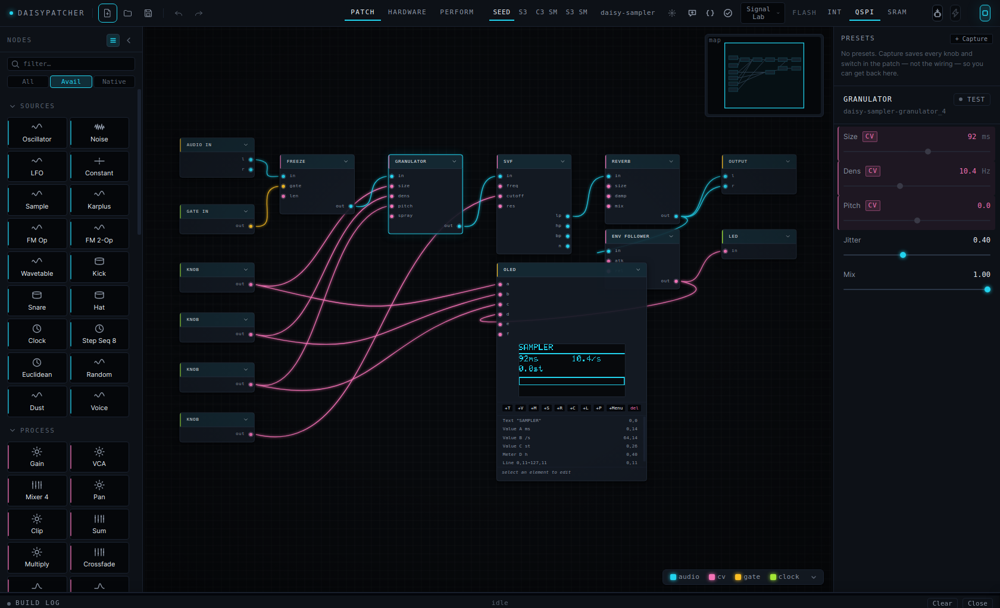
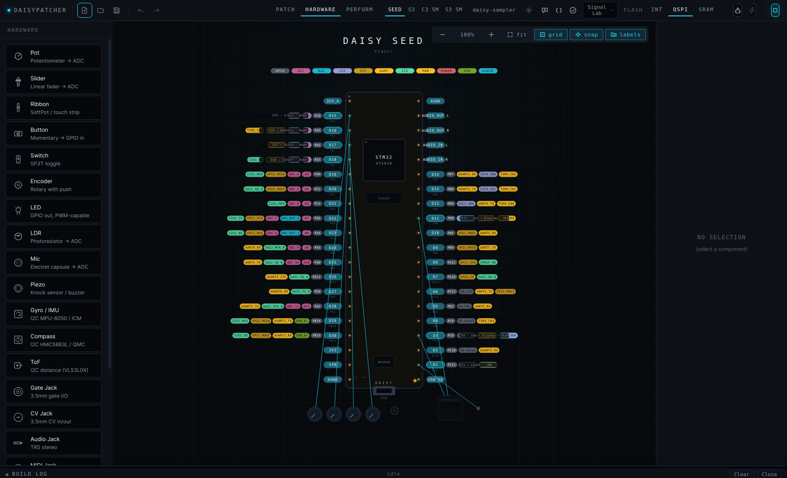
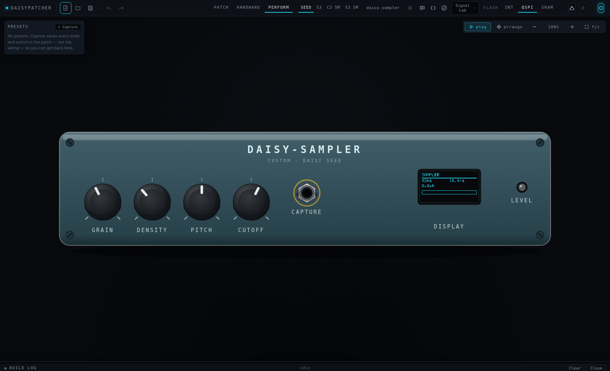

<p align="center">
  
</p>

<h1 align="center">Daisypatcher</h1>

<p align="center">
  A visual patcher for the Electro-Smith <strong>Daisy Seed</strong> and the <strong>ESP32-S3 / C3</strong>.<br>
  Drop DSP nodes on a canvas, hear the patch in the app, lay out the knobs and jacks, flash the board.
</p>

<p align="center">
  <a href="https://github.com/willbearfruits/daisypatcher/releases/latest"></a>
  <a href="https://github.com/willbearfruits/daisypatcher/actions/workflows/ci.yml"></a>
  <a href="./LICENSE"></a>
</p>

<p align="center">
  <a href="https://willbearfruits.github.io/daisypatcher/">Website</a> ·
  <a href="docs/USER_GUIDE.md">User guide</a> ·
  <a href="examples/README.md">Example patches</a> ·
  <a href="https://github.com/willbearfruits/daisypatcher/releases">Downloads</a> ·
  <a href="https://github.com/willbearfruits/daisypatcher/issues/new">Report a bug</a>
</p>

---

> **Beta.** This is a work in progress that already does the whole loop — patch, listen, build, flash — on real hardware, but it has been used by a small number of people on a small number of machines. Expect rough edges. Every one you report gets looked at.

<p align="center">
  
</p>

## What it does

**The patch is the firmware.** Every node in the palette is two things: a WebAudio worklet that runs in the app so you can hear it now, and a C++ emitter that produces the same DSP for the board. The two are checked against each other — the same patch is rendered through the emulator and through the compiled firmware, and the waveforms are compared — so what you hear at your desk is what the device plays.

- **95 node kinds.** Oscillators, wavetable, FM, Karplus, drums, filters (SVF, ladder, comb, formant), envelopes, LFOs, sequencers (step, Euclidean, tracker-style), quantiser, sample player, delays, reverbs, chorus/phaser/flanger, granulator, pitch shifter, compressor/limiter/gate, bitcrusher, wavefolder, mixers and CV maths, logic (gates, flip-flops, counters, timers, state machines), scope/VU/spectrum, an OLED with an in-node display designer, a menu system, MIDI, and a **Code node** for the thing that is not in the list.
- **Three views.** *Patch* is the graph. *Hardware* is your board drawn to scale — drop pots, buttons, LEDs, encoders, an OLED, jacks, sensors, an I²S DAC onto real pins. *Perform* is the finished box: the enclosure, the controls where your hands would find them, playable with the mouse.
- **Subpatches and polyphony.** Collapse a selection into a box; run a box N times as voices.
- **Presets** that morph, and that compile into the firmware so a button on the device can recall them.
- **Samples** compiled into flash.
- **Build and flash** from inside the app: libDaisy/DaisySP for the Seed (installed on first run), PlatformIO for the ESP32s. Serial monitor included.
- **An assistant** that edits the graph — never writes code — with every proposed edit validated against the node catalog before it can touch your patch. Ollama by default; cloud providers if you bring a key.

<p align="center">
  
  
</p>

## Boards

| Board | Audio | Notes |
|---|---|---|
| **Daisy Seed** | onboard codec | The reference target. 94 of 95 kinds native. |
| **ESP32-S3 DevKitC** | I²S DAC (PCM5102A / MAX98357A) | 91 native; `granulator` runs with a shorter buffer without PSRAM; `expression` and the I²S pass-through kinds are stubs. |
| **ESP32-S3 SuperMini** | I²S DAC | As DevKitC. Pinout provisional — confirm against your board. |
| **ESP32-C3 SuperMini** | I²S DAC | As above, minus USB-MIDI (RISC-V has no TinyUSB device stack). |

The palette greys out what the selected board cannot run, and says why.

## Install

Grab the latest build from the [Releases page](https://github.com/willbearfruits/daisypatcher/releases).

| OS | File | Notes |
|---|---|---|
| Linux | `Daisypatcher-<ver>.AppImage` (x64, arm64) | `chmod +x`, run. For a launcher entry and `.dpatch` association use [AppImageLauncher](https://github.com/TheAssassin/AppImageLauncher) or your distro's equivalent. |
| Windows | `Daisypatcher-Setup-<ver>.exe` or `-portable.exe` | Unsigned — SmartScreen will ask; *More info → Run anyway*. |
| macOS | `Daisypatcher-<ver>.dmg` (Intel, Apple Silicon) | Unsigned — right-click → *Open* the first time. Auto-update is off on macOS for that reason. |

The app **does not bundle the compilers**. You can patch and listen without them; to Build and Flash you need, per board:

<details>
<summary><strong>Daisy Seed</strong> — <code>git</code>, <code>make</code>, <code>arm-none-eabi-gcc</code>, <code>dfu-util</code></summary>

- Debian/Ubuntu: `sudo apt install git build-essential gcc-arm-none-eabi dfu-util`
- Fedora: `sudo dnf install git make arm-none-eabi-gcc-cs arm-none-eabi-newlib dfu-util`
- Arch: `sudo pacman -S git make arm-none-eabi-gcc arm-none-eabi-newlib dfu-util`
- macOS: `xcode-select --install && brew install --cask gcc-arm-embedded && brew install dfu-util`
- Windows: the [Daisy Toolchain](https://github.com/electro-smith/DaisyToolchain) installer bundles all three; run [Zadig](https://zadig.akeo.ie/) once to bind WinUSB to the Seed in DFU mode.

On first launch the app clones and builds libDaisy + DaisySP (~50 MB, a few minutes) into its config directory. If a tool is missing it tells you which and how to get it, before it downloads anything.

**Linux flashing permission** — the Seed's DFU bootloader is root-only by default. One-time:

```bash
echo 'SUBSYSTEM=="usb", ATTRS{idVendor}=="0483", ATTRS{idProduct}=="df11", MODE="0666"' | \
  sudo tee /etc/udev/rules.d/50-daisy-dfu.rules
sudo udevadm control --reload-rules
sudo usermod -aG dialout $USER   # serial monitor; log out and in again
```
</details>

<details>
<summary><strong>ESP32-S3 / C3</strong> — Python 3 and PlatformIO</summary>

Install Python 3 (python.org on Windows, tick *Add to PATH*; your package manager elsewhere). Then click the board's status dot in the top bar: the app installs PlatformIO into your user environment (pipx if present, `pip --user` otherwise) and pre-downloads the ESP32 platform (~300 MB) so the first build does not stall. Or do it yourself: `pipx install platformio`.

On Linux, add yourself to `dialout` (above) for the serial port.
</details>

## First five minutes

1. **File → Open Example…** — seven patches ship with the app, from a two-node drone to a four-track tracker.
2. **Space** to hear it. Turn a knob in the Inspector.
3. **Hardware** tab: the pot is already on a pin. Drag another component on; a matching node appears in the patch, wired to a free pin.
4. Pick your board in the top bar. **Build** (Ctrl+Enter). Watch the log.
5. Put the board in bootloader mode (Seed: hold BOOT, tap RESET). **Flash**.

The whole guide is in the app under **Help → Daisypatcher Guide** (F1), and [here](docs/USER_GUIDE.md).

## How it is checked

Five test layers, cheapest first; the first three run in CI on every push:

1. **Snapshots** — every example patch × every board, generated C++ diffed against a checked-in copy.
2. **Contract** — every kind that claims to support a board must have a real emitter there; every output it declares must be produced at block scope; all boards must agree on which outputs exist.
3. **Features** — behavioural checks with no compiler: voice expansion, presets reaching the firmware globals, samples landing in flash, the logic nodes counting, `.dpatch` save→load being a fixed point, and the assistant's validator rejecting every class of malformed edit.
4. **Compile** — per-node `make` / `pio run` for all four boards (needs the toolchains, so local only).
5. **Audio parity** — the patch through the real emulator worklets vs. the same patch's compiled Daisy firmware run on the host, level and waveform compared. The one that listens.

`npm run test` is layers 1–3 plus typecheck.

## The assistant and your data

The assistant is optional and off until you open it. When you send it a request, **the current patch (node kinds, parameters, connections — not your samples, not your files) and your message go to the provider you chose**:

- **Ollama** (default): local. Nothing leaves your machine.
- **Anthropic / OpenAI**: sent to their API over HTTPS. Your key is stored in the app's config directory, readable only by your user, and never enters the app window.

Nothing else in the app talks to the network except the update check against GitHub Releases (Linux/Windows), and the one-time SDK clone from GitHub. There is no telemetry.

## Where things live

| | Linux | macOS | Windows |
|---|---|---|---|
| SDK, workspaces, sample library, settings | `~/.config/Daisypatcher/` | `~/Library/Application Support/Daisypatcher/` | `%APPDATA%\Daisypatcher\` |

Running from source uses `daisypatcher` (lower-case) instead. Your patches are wherever you save them — `.dpatch` is JSON, readable, diffable.

## Running from source

Node 22+.

```bash
git clone https://github.com/willbearfruits/daisypatcher.git
cd daisypatcher
npm install
npm run dev          # Electron with HMR
npm run test         # the CI gate
npm run dist:linux   # AppImage; dist:win, dist:all likewise
```

Architecture, the checklist for adding a node kind, and every non-obvious gotcha are in [`CLAUDE.md`](./CLAUDE.md). It is written for an AI pair-programmer but it is the honest map of the codebase.

## Known limits (beta)

- The Windows and macOS builds come off CI and are not code-signed; they are less travelled than Linux.
- Presets capture the level you are looking at: nodes inside a subpatch are not part of a top-level preset, and only top-level parameters reach the device.
- ESP32-S3 SuperMini pin table is provisional.
- No MIDI learn, no recording of the emulator to `.wav`, no reverse import of hand-written firmware. See [`V0_5_PLAN.md`](./V0_5_PLAN.md) and [`V2_PLAN.md`](./V2_PLAN.md) for the direction.

## Contributing

Issues are the most useful thing right now — a `.dpatch` that does something wrong, attached to a report, is gold. PRs welcome; see [`CONTRIBUTING.md`](./CONTRIBUTING.md). A new node kind is the classic first contribution and the checklist is short.

## License

**AGPL-3.0-or-later** — see [`LICENSE`](./LICENSE). Use it, fork it, ship it; if you distribute a modified version (including as a hosted service), your changes must be open under the same terms.

The license covers **the app**. Firmware **generated by** the app is your own work. It links libDaisy and DaisySP (MIT) and, for the Seed, the DaisySP-LGPL subset (ReverbSc, Compressor and friends) — if you distribute compiled firmware *binaries*, the LGPL part carries relink/source-availability obligations for that library. Firmware you flash to your own hardware is unaffected.
